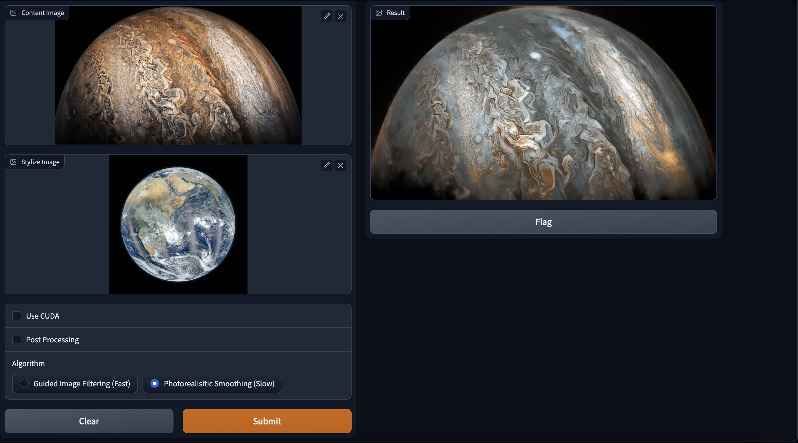
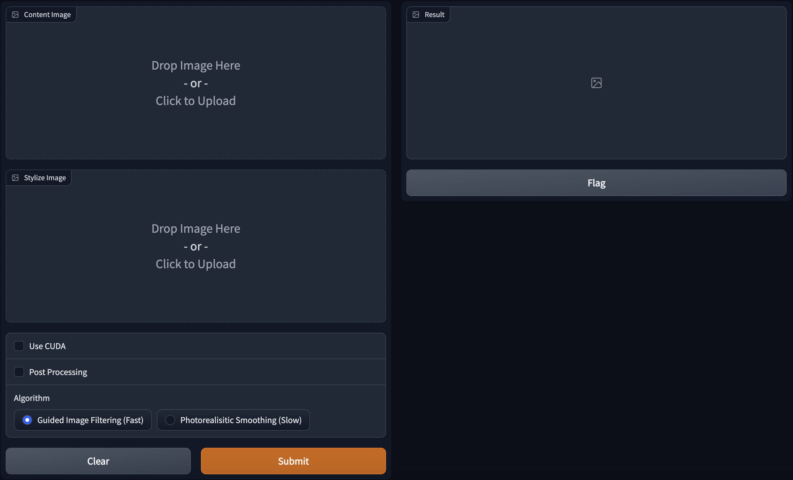
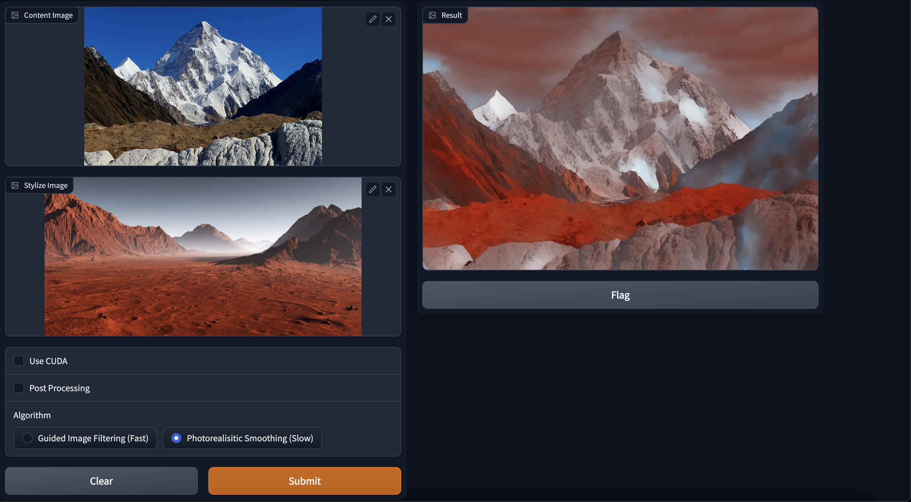

[](https://raw.githubusercontent.com/NVIDIA/FastPhotoStyle/master/LICENSE.md)

# Photo-Realistic-Image-Stylization

> Whitening and Colorization Transform from the paper "A Closed-form Solution to Photorealistic Image Stylization"
<br />

 

## Python dependencies

```sh
pip3 install -r requirements.txt
```

---

<br />

## Run the application

```sh
python3 app.py
```

On your terminal, you will see a prompt of the ipaddress to access - 

```sh
Running on local URL:  http://127.0.0.1:7860
```

Open the url in a browser and you should be greeted with a webapp built with `gradio`

 

By adding a `content image`, `style image` and choosing the appropriate algorithm, you can style your image

 

---

## License
Copyright (C) 2018 NVIDIA Corporation.  All rights reserved.
Licensed under the CC BY-NC-SA 4.0 license (https://creativecommons.org/licenses/by-nc-sa/4.0/legalcode).

<br />

---

## Citations

- [A Closed-form Solution to Photorealistic Image Stylization](https://arxiv.org/abs/1802.06474) <br> 
[Yijun Li (UC Merced)](https://sites.google.com/site/yijunlimaverick/), [Ming-Yu Liu (NVIDIA)](http://mingyuliu.net/), [Xueting Li (UC Merced)](https://sunshineatnoon.github.io/), [Ming-Hsuan Yang (NVIDIA, UC Merced)](http://faculty.ucmerced.edu/mhyang/), [Jan Kautz (NVIDIA)](http://jankautz.com/) <br>

- [https://github.com/NVIDIA/FastPhotoStyle](https://github.com/NVIDIA/FastPhotoStyle) <br>

